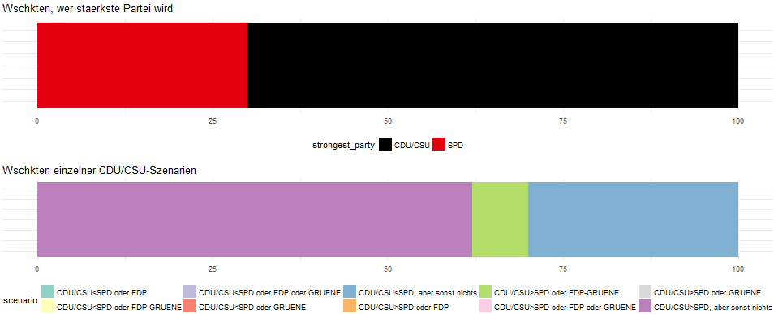
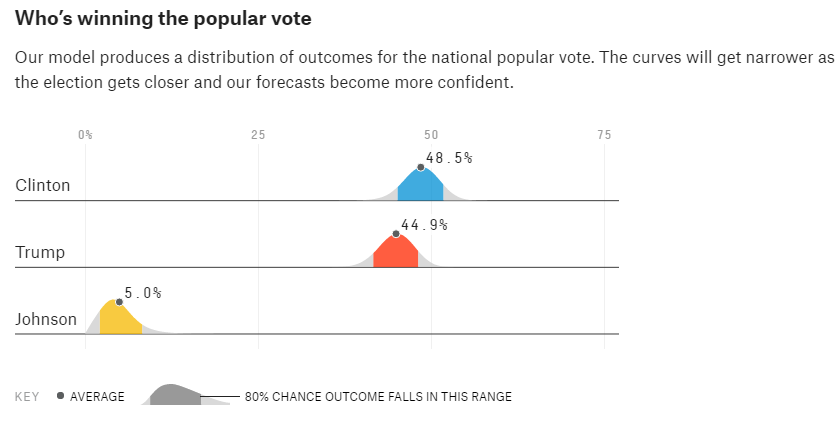
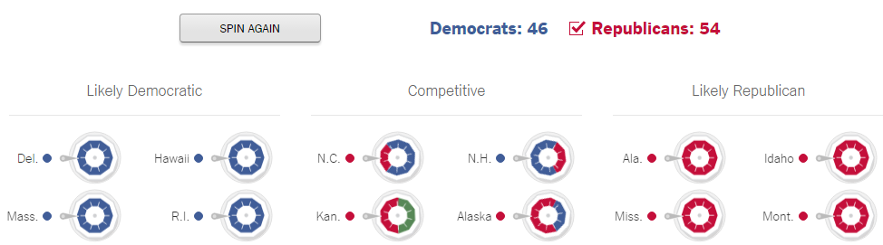

## Inhalt dieser Präsentation

1. Stand der statistischen Methodik
2. Aktuelle Ergebnisse
3. Anregungen für grafische Darstellungen

## 1) Methodik

- Grundlage: Gleiche Methodik wie für Wahlistik 2013
- Weiterentwicklung der gepoolten Umfrage aller Wahlinstitute aktuell in Arbeit  
(Ansatz: Mögliche Korrelation der gepoolten Umfrageinstitute wurde 2013 nicht berücksichtigt)
- Aktuell stehen also die Ergebnisse zu einzelnen Umfrageinstituten zur Verfügung

## 2) Aktuelle Ergebnisse
Koalitionswahrscheinlichkeiten basierend auf den letzten drei Emnid-Umfragen finden sich im angefügten csv.
In Zukunft würden Sie die Daten von uns immer in diesem Format erhalten (dann auch für weiter zurückliegende Umfragen und mehr Koalitionen).

Nächste beiden Folien zeigen Emnid-basierte Koalitionswahrscheinlichkeiten über die Zeit.

Dabei zu beachten:

1. Pro Koalition ist Wahrscheinlichkeit angegeben, mit welcher diese zustande kommen kann
2. Die Wahrscheinlichkeiten summieren sich folglich hier **nicht** zu 1 auf!

## 2) Aktuelle Ergebnisse
Wahrscheinlichkeiten pro Koalition:

## 2) Aktuelle Ergebnisse
Wahrscheinlichkeiten CDU/CSU- vs SPD-geführte Koalition:

## 3) Anregungen für Darstellungen
- Unterscheidung Szenarien:

Erläuterung der Grafik siehe nächste Folie.

## 3) Anregungen für Darstellungen
Obere Grafik zeigt (als einfacher Einstieg), dass die CDU aktuell eine höhere Wahrscheinlichkeit hat stärkste Partei zu werden als die SPD.

Die untere Grafik unterteilt die oben dargestellten Fälle (CDU oder SPD stärkste Partei) weiter in **CDU-spezifische Entscheidungsmöglichkeiten nach der Wahl**:

- blauer Block: Mit ca. 30% Wahrscheinlichkeit kann sich die CDU nur an der Regierung beteiligen, indem sie als Juniorpartner in eine GroKo geht. Ansonsten hat sie keine anderen Koalitionsoptionen. Der blaue Block entspricht aktuell genau der Wahrscheinlichkeit, dass die SPD stärkste Partei wird.

## 3) Anregungen für Darstellungen
- lila: Mit ca. 60% Wahrscheinlichkeit hat die CDU (als in diesen Fällen stärkste Partei) nur eine einzige Koalitionsmöglichkeit: Selbst eine GroKo anzuführen.
- grün: Mit ca. 10% Wahrscheinlichkeit hat die CDU (als stärkste Partei) neben eine GroKo noch eine weitere Option: Sie könnte auch eine Koalition mit FDP und Grünen eingehen.

## 3) Anregungen für Darstellungen
- Darstellung der Unsicherheit, wie viele Sitze eine Koalition bekommt

Beispiel: https://projects.fivethirtyeight.com/2016-election-forecast/?ex_cid=2016-election

## 3) Anregungen für Darstellungen
- Interaktive Darstellung des Konzepts von Koalitions-**Wahrscheinlichkeiten**

Beispiel: http://www.nytimes.com/newsgraphics/2014/senate-model/

## 3) Anregungen für Darstellungen
- Interaktive Darstellung des Konzepts von Koalitions-**Wahrscheinlichkeiten**

Hier: Man könnte z.B. auf Knopfdruck jeweils 10 kleine Bundestagsverteilungen darstellen mit simulierten Ausgängen der Wahl, um den Nutzern ein Gefühl dafür zu geben, dass die Koalitionswahrscheinlichkeiten über **viele** Wahlen natürlich gelten, es bei **einer** Wahl aber durchaus sein kann, dass nicht einfach die höchste Wahrscheinlichkeit gewinnt.

## 3) Anregungen für Darstellungen
- Interaktive Darstellung des Konzepts von Koalitions-**Wahrscheinlichkeiten**

Außerdem: Man könnte dem Nutzer auch die Möglichkeit geben die Umfrageergebnisse selbst zu verändern, s.d. man sich anschauen kann wie z.B. die Wahrscheinlichkeiten wären, wenn die SPD 1-2% niedriger liegt.